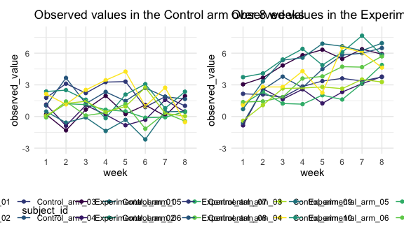
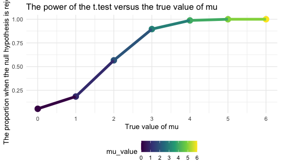
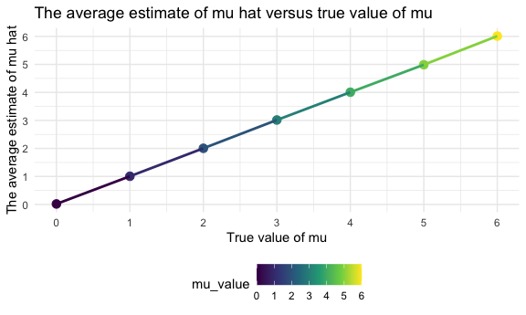

Homework 5
================
Danyang Gui

## Problem 1

Read in the data.

``` r
homicide_df = 
  read_csv("homicide_data/homicide-data.csv") %>% 
  mutate(
    city_state = str_c(city, state, sep = "_"),
    resolved = case_when(
      disposition == "Closed without arrest" ~ "unsolved",
      disposition == "Open/No arrest"        ~ "unsolved",
      disposition == "Closed by arrest"      ~ "solved",
    )
  ) %>% 
  select(city_state, resolved) %>% 
  filter(city_state != "Tulsa_AL")
```

    ## Parsed with column specification:
    ## cols(
    ##   uid = col_character(),
    ##   reported_date = col_double(),
    ##   victim_last = col_character(),
    ##   victim_first = col_character(),
    ##   victim_race = col_character(),
    ##   victim_age = col_character(),
    ##   victim_sex = col_character(),
    ##   city = col_character(),
    ##   state = col_character(),
    ##   lat = col_double(),
    ##   lon = col_double(),
    ##   disposition = col_character()
    ## )

Let’s look at this a bit

``` r
aggregate_df = 
  homicide_df %>% 
  group_by(city_state) %>% 
  summarize(
    hom_total = n(),
    hom_unsolved = sum(resolved == "unsolved")
  )
```

    ## `summarise()` ungrouping output (override with `.groups` argument)

Can I do a prop test for a single city?

``` r
prop.test(
  aggregate_df %>% filter(city_state == "Baltimore_MD") %>% pull(hom_unsolved), 
  aggregate_df %>% filter(city_state == "Baltimore_MD") %>% pull(hom_total)) %>% 
  broom::tidy()
```

    ## # A tibble: 1 x 8
    ##   estimate statistic  p.value parameter conf.low conf.high method    alternative
    ##      <dbl>     <dbl>    <dbl>     <int>    <dbl>     <dbl> <chr>     <chr>      
    ## 1    0.646      239. 6.46e-54         1    0.628     0.663 1-sample… two.sided

Try to iterate ……..

``` r
results_df = 
  aggregate_df %>% 
  mutate(
    prop_tests = map2(.x = hom_unsolved, .y = hom_total, ~prop.test(x = .x, n = .y)),
    tidy_tests = map(.x = prop_tests, ~broom::tidy(.x))
  ) %>% 
  select(-prop_tests) %>% 
  unnest(tidy_tests) %>% 
  select(city_state, estimate, conf.low, conf.high)
```

``` r
results_df %>% 
  mutate(city_state = fct_reorder(city_state, estimate)) %>% 
  ggplot(aes(x = city_state, y = estimate)) +
  geom_point() + 
  geom_errorbar(aes(ymin = conf.low, ymax = conf.high)) + 
  theme(axis.text.x = element_text(angle = 90, vjust = 0.5, hjust = 1))
```


``` r
city_prop_test = function(df) {
  
  n_unsovled ...
  n_total ... 
  
  prop.test(.....)
  
}
homicide_df = 
  read_csv("data/homicide-data.csv") %>% 
  mutate(
    city_state = str_c(city, state, sep = "_"),
    resolved = case_when(
      disposition == "Closed without arrest" ~ "unsolved",
      disposition == "Open/No arrest"        ~ "unsolved",
      disposition == "Closed by arrest"      ~ "solved",
    )
  ) %>% 
  select(city_state, resolved) %>% 
  filter(city_state != "Tulsa_AL") %>% 
  nest(data = resolved)
```

    ## Error: <text>:3:14: unexpected symbol
    ## 2:   
    ## 3:   n_unsovled ...
    ##                 ^

## Problem 2

import one dataset

``` r
path_df = 
  tibble(
    path = list.files("lda_data"),
  ) %>% 
  mutate(
    path = str_c("lda_data/", path),
    data = map(path, read_csv)) %>%
  unnest(data)
```

    ## Parsed with column specification:
    ## cols(
    ##   week_1 = col_double(),
    ##   week_2 = col_double(),
    ##   week_3 = col_double(),
    ##   week_4 = col_double(),
    ##   week_5 = col_double(),
    ##   week_6 = col_double(),
    ##   week_7 = col_double(),
    ##   week_8 = col_double()
    ## )
    ## Parsed with column specification:
    ## cols(
    ##   week_1 = col_double(),
    ##   week_2 = col_double(),
    ##   week_3 = col_double(),
    ##   week_4 = col_double(),
    ##   week_5 = col_double(),
    ##   week_6 = col_double(),
    ##   week_7 = col_double(),
    ##   week_8 = col_double()
    ## )
    ## Parsed with column specification:
    ## cols(
    ##   week_1 = col_double(),
    ##   week_2 = col_double(),
    ##   week_3 = col_double(),
    ##   week_4 = col_double(),
    ##   week_5 = col_double(),
    ##   week_6 = col_double(),
    ##   week_7 = col_double(),
    ##   week_8 = col_double()
    ## )
    ## Parsed with column specification:
    ## cols(
    ##   week_1 = col_double(),
    ##   week_2 = col_double(),
    ##   week_3 = col_double(),
    ##   week_4 = col_double(),
    ##   week_5 = col_double(),
    ##   week_6 = col_double(),
    ##   week_7 = col_double(),
    ##   week_8 = col_double()
    ## )
    ## Parsed with column specification:
    ## cols(
    ##   week_1 = col_double(),
    ##   week_2 = col_double(),
    ##   week_3 = col_double(),
    ##   week_4 = col_double(),
    ##   week_5 = col_double(),
    ##   week_6 = col_double(),
    ##   week_7 = col_double(),
    ##   week_8 = col_double()
    ## )
    ## Parsed with column specification:
    ## cols(
    ##   week_1 = col_double(),
    ##   week_2 = col_double(),
    ##   week_3 = col_double(),
    ##   week_4 = col_double(),
    ##   week_5 = col_double(),
    ##   week_6 = col_double(),
    ##   week_7 = col_double(),
    ##   week_8 = col_double()
    ## )
    ## Parsed with column specification:
    ## cols(
    ##   week_1 = col_double(),
    ##   week_2 = col_double(),
    ##   week_3 = col_double(),
    ##   week_4 = col_double(),
    ##   week_5 = col_double(),
    ##   week_6 = col_double(),
    ##   week_7 = col_double(),
    ##   week_8 = col_double()
    ## )
    ## Parsed with column specification:
    ## cols(
    ##   week_1 = col_double(),
    ##   week_2 = col_double(),
    ##   week_3 = col_double(),
    ##   week_4 = col_double(),
    ##   week_5 = col_double(),
    ##   week_6 = col_double(),
    ##   week_7 = col_double(),
    ##   week_8 = col_double()
    ## )
    ## Parsed with column specification:
    ## cols(
    ##   week_1 = col_double(),
    ##   week_2 = col_double(),
    ##   week_3 = col_double(),
    ##   week_4 = col_double(),
    ##   week_5 = col_double(),
    ##   week_6 = col_double(),
    ##   week_7 = col_double(),
    ##   week_8 = col_double()
    ## )
    ## Parsed with column specification:
    ## cols(
    ##   week_1 = col_double(),
    ##   week_2 = col_double(),
    ##   week_3 = col_double(),
    ##   week_4 = col_double(),
    ##   week_5 = col_double(),
    ##   week_6 = col_double(),
    ##   week_7 = col_double(),
    ##   week_8 = col_double()
    ## )
    ## Parsed with column specification:
    ## cols(
    ##   week_1 = col_double(),
    ##   week_2 = col_double(),
    ##   week_3 = col_double(),
    ##   week_4 = col_double(),
    ##   week_5 = col_double(),
    ##   week_6 = col_double(),
    ##   week_7 = col_double(),
    ##   week_8 = col_double()
    ## )
    ## Parsed with column specification:
    ## cols(
    ##   week_1 = col_double(),
    ##   week_2 = col_double(),
    ##   week_3 = col_double(),
    ##   week_4 = col_double(),
    ##   week_5 = col_double(),
    ##   week_6 = col_double(),
    ##   week_7 = col_double(),
    ##   week_8 = col_double()
    ## )
    ## Parsed with column specification:
    ## cols(
    ##   week_1 = col_double(),
    ##   week_2 = col_double(),
    ##   week_3 = col_double(),
    ##   week_4 = col_double(),
    ##   week_5 = col_double(),
    ##   week_6 = col_double(),
    ##   week_7 = col_double(),
    ##   week_8 = col_double()
    ## )
    ## Parsed with column specification:
    ## cols(
    ##   week_1 = col_double(),
    ##   week_2 = col_double(),
    ##   week_3 = col_double(),
    ##   week_4 = col_double(),
    ##   week_5 = col_double(),
    ##   week_6 = col_double(),
    ##   week_7 = col_double(),
    ##   week_8 = col_double()
    ## )
    ## Parsed with column specification:
    ## cols(
    ##   week_1 = col_double(),
    ##   week_2 = col_double(),
    ##   week_3 = col_double(),
    ##   week_4 = col_double(),
    ##   week_5 = col_double(),
    ##   week_6 = col_double(),
    ##   week_7 = col_double(),
    ##   week_8 = col_double()
    ## )
    ## Parsed with column specification:
    ## cols(
    ##   week_1 = col_double(),
    ##   week_2 = col_double(),
    ##   week_3 = col_double(),
    ##   week_4 = col_double(),
    ##   week_5 = col_double(),
    ##   week_6 = col_double(),
    ##   week_7 = col_double(),
    ##   week_8 = col_double()
    ## )
    ## Parsed with column specification:
    ## cols(
    ##   week_1 = col_double(),
    ##   week_2 = col_double(),
    ##   week_3 = col_double(),
    ##   week_4 = col_double(),
    ##   week_5 = col_double(),
    ##   week_6 = col_double(),
    ##   week_7 = col_double(),
    ##   week_8 = col_double()
    ## )
    ## Parsed with column specification:
    ## cols(
    ##   week_1 = col_double(),
    ##   week_2 = col_double(),
    ##   week_3 = col_double(),
    ##   week_4 = col_double(),
    ##   week_5 = col_double(),
    ##   week_6 = col_double(),
    ##   week_7 = col_double(),
    ##   week_8 = col_double()
    ## )
    ## Parsed with column specification:
    ## cols(
    ##   week_1 = col_double(),
    ##   week_2 = col_double(),
    ##   week_3 = col_double(),
    ##   week_4 = col_double(),
    ##   week_5 = col_double(),
    ##   week_6 = col_double(),
    ##   week_7 = col_double(),
    ##   week_8 = col_double()
    ## )
    ## Parsed with column specification:
    ## cols(
    ##   week_1 = col_double(),
    ##   week_2 = col_double(),
    ##   week_3 = col_double(),
    ##   week_4 = col_double(),
    ##   week_5 = col_double(),
    ##   week_6 = col_double(),
    ##   week_7 = col_double(),
    ##   week_8 = col_double()
    ## )

tidy the dataset:

``` r
lda_df = 
  path_df %>%
  mutate(
    subject_id = str_replace(path, ".csv", ""),
    subject_id = str_replace(subject_id, "lda_data/", "")) %>%
 select(subject_id, week_1:week_8) %>%
 separate(subject_id, into = c("group", "id"), sep = "_") %>%
 pivot_longer(
    week_1:week_8,
    names_to = "week",
    names_prefix = "week_",
    values_to = "observed_value",
  ) %>%
  mutate(
    group = case_when(
      group == "con" ~ "Control_arm",
      group == "exp" ~ "Experimental_arm"))

lda_df
```

    ## # A tibble: 160 x 4
    ##    group       id    week  observed_value
    ##    <chr>       <chr> <chr>          <dbl>
    ##  1 Control_arm 01    1               0.2 
    ##  2 Control_arm 01    2              -1.31
    ##  3 Control_arm 01    3               0.66
    ##  4 Control_arm 01    4               1.96
    ##  5 Control_arm 01    5               0.23
    ##  6 Control_arm 01    6               1.09
    ##  7 Control_arm 01    7               0.05
    ##  8 Control_arm 01    8               1.94
    ##  9 Control_arm 02    1               1.13
    ## 10 Control_arm 02    2              -0.88
    ## # … with 150 more rows

make a spaghetti plot showing observations on each subject over time,
and comment on differences between groups.

``` r
plot =
  lda_df %>%
  unite(subject_id, group, id) %>% 
  ggplot(aes(x = week, y = observed_value, group = subject_id, color = subject_id)) +
  geom_point() +
  geom_line()

plot
```



From the spaghetti plot, we can tell that the subjects in the two groups
have similar values at the beginning of the study. During the 8 weeks of
observation, the subjects in the experimental arm collectively have a
higher measurements than subjects in the control arm.

## Problem 3

``` r
t_esti_pvalue = function(n = 30, mu, sigma = 5) { #default sample size and sd
  
  sim_data =
    tibble(
     x = rnorm(n, mean = mu, sd = sigma)
    )
  
  sim_data %>%
    summarize(
      t_test = t.test(x, mu = mu, conf.level = 0.95) %>% 
        broom::tidy() %>% 
        select(p.value, estimate)
  )
  
}
```

``` r
set.seed(100)
sim_results_0 =   
  rerun(5000, t_esti_pvalue(mu = 0)) %>% 
  bind_rows() %>% 
  mutate(
    mu_hat = pull(t_test,estimate),
    p_value = pull(t_test,p.value)) %>% 
  select(-t_test)

sim_results_0
```

    ## # A tibble: 5,000 x 2
    ##    mu_hat p_value
    ##     <dbl>   <dbl>
    ##  1  0.144   0.823
    ##  2  0.463   0.667
    ##  3 -0.219   0.827
    ##  4 -0.375   0.680
    ##  5 -0.796   0.259
    ##  6  0.838   0.240
    ##  7 -0.358   0.688
    ##  8 -0.546   0.505
    ##  9  0.323   0.779
    ## 10  0.974   0.247
    ## # … with 4,990 more rows

``` r
set.seed(100)
results_df = 
  tibble(mu_value = c(0,1,2,3,4,5,6)) %>% 
  mutate(
    output_lists = map(.x = mu_value, ~rerun(5000, t_esti_pvalue(mu = .x))),
    estimate_pvalue_df = map(output_lists, bind_rows)) %>%
  select(-output_lists) %>%
  unnest(estimate_pvalue_df) %>%
  mutate(
    mu_hat = t_test$estimate,
    p_value = t_test$p.value) %>% 
  select(mu_value, mu_hat, p_value)


results_df
```

    ## # A tibble: 35,000 x 3
    ##    mu_value mu_hat p_value
    ##       <dbl>  <dbl>   <dbl>
    ##  1        0  0.144   0.823
    ##  2        0  0.463   0.667
    ##  3        0 -0.219   0.827
    ##  4        0 -0.375   0.680
    ##  5        0 -0.796   0.259
    ##  6        0  0.838   0.240
    ##  7        0 -0.358   0.688
    ##  8        0 -0.546   0.505
    ##  9        0  0.323   0.779
    ## 10        0  0.974   0.247
    ## # … with 34,990 more rows

Make a plot showing the proportion of times the null was rejected (the
power of the test) on the y axis and the true value of mu on the x axis.
Describe the association between effect size and power.

``` r
plot_1 = 
  results_df %>%
  group_by(mu_value) %>% 
  filter(p_value < 0.05) %>% 
  count() %>% 
  mutate(
    proportion = n / 5000
  ) %>% 
  ggplot(aes(x = mu_value, y = proportion, color = mu_value)) +
  geom_point()+
  geom_line() +
  labs(
    title = "The power of the t.test versus the true value of mu",
    x = "True value of mu",
    y = "The proportion when the null hypothesis is rejected") + 
  scale_x_continuous(
    breaks = c(0,1,2,3,4,5,6), 
    limits = c(0,6)) 

plot_1
```



The power increases as the effect size(true value of mu) increases.

Make a plot showing the average estimate of mu on the y axis and the
true value of mu on the x axis.

``` r
plot_2 =
  results_df %>%
  group_by(mu_value) %>% 
  summarize(
    average_estimate = mean(mu_hat)
  ) %>% 
  ggplot(aes(x = mu_value, y = average_estimate, color = mu_value)) +
  geom_point()+
  geom_line() +
  labs(
    title = "The average estimate of mu hat versus true value of mu",
    x = "True value of mu",
    y = "The average estimate of mu hat") + 
  scale_x_continuous(
    breaks = c(0,1,2,3,4,5,6), 
    limits = c(0,6)) 
```

    ## `summarise()` ungrouping output (override with `.groups` argument)

``` r
plot_2
```


